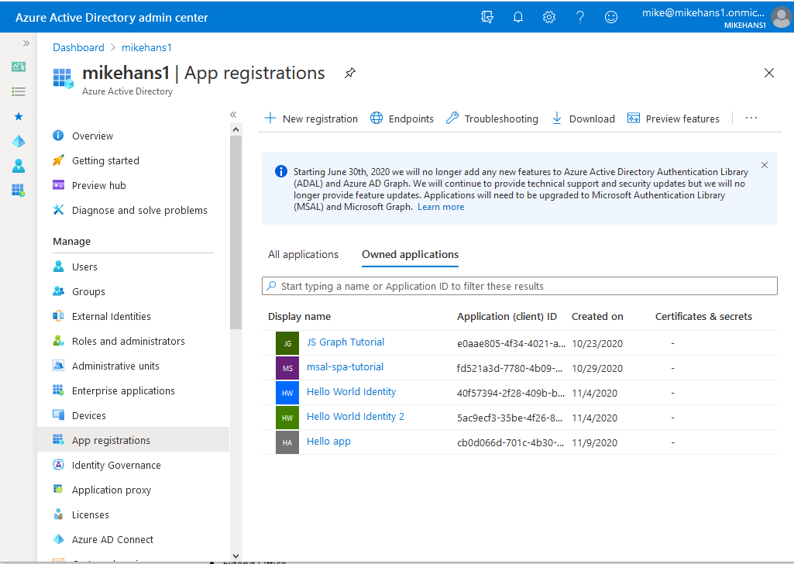

## Summary of what I think matters so far
OK, so Microsoft Identity is a large component of MS-600: Building Applications and Solutions with Microsoft 365 Core Services. It's the exam you need for the <a href="https://docs.microsoft.com/en-us/learn/certifications/m365-developer-associate" target="_blank" rel="noreferrer"> Microsoft 365 Certified: Developer Associate certification</a>. 

Identity is a large and complex domain of knowledge, so I want to unpack it a bit here. Importantly, what is the required knowledge and what are the constraints for the exam?

## Resources
The <a href="https://docs.microsoft.com/en-us/learn/paths/m365-identity-associate/" target="_blank" rel="noreferrer">Microsoft Learn path for Identity</a> is a good starting point.
The <a href="https://docs.microsoft.com/en-us/azure/active-directory/develop/" target="_blank" rel="noreferrer">Azure Active Directory documentation</a> is also really important.

## Glossary
* Account type
* Delegated permissions
* Consent
* OpenID Connect
* OAuth 2.0
* Home tenant
* Appliction object
* Service principal object
* Guest account

## Register an application
This is referring to the process of creating the application object in AAD.

### Determine the supported account type
This is talking specifically about the account type for the application object you are creating.

The key here is what do each of the four options under "Supported account types" grant / prohibit?
* Accounts in this organisational directory only (single tenant)
    * an application has something called a home tenant
    * only users in the same home tenant as the application can sign into it (_mikehans1_ in the example)
    * therefore, a user must be an AAD of this tenant
    * this is for use in line of business applications
* Accounts in any organisational directory (AAD multi-tenant)
    * users in AAD organisations outside of the home tenant can sign into the application
    * useful for ISVs
    * _do I need this to allow federated users to sign in?_
        * _or by creating a guest account, does this allow me to use a single tenant account type?_
* Accounts in any organisational directory and personal Microsoft accounts
* Personal Microsoft accounts only

#### Resources for this criteria
* <a hrf="https://docs.microsoft.com/en-us/learn/modules/getting-started-identity/4-different-account-types" target="_blank" rel="noreferrer">MS Learn page</a>