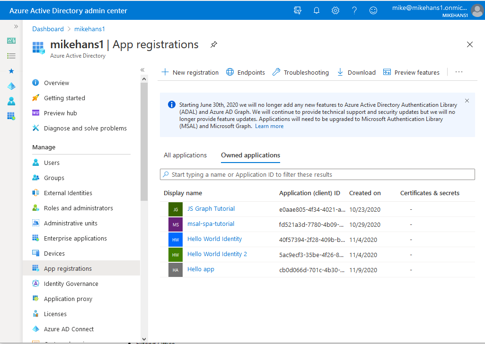
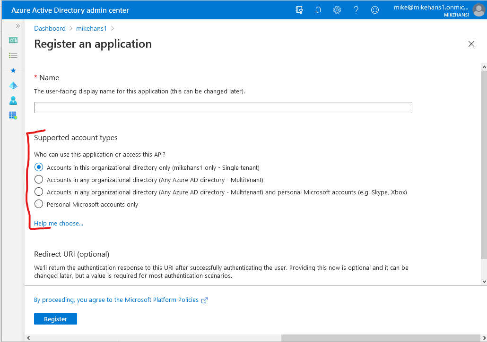
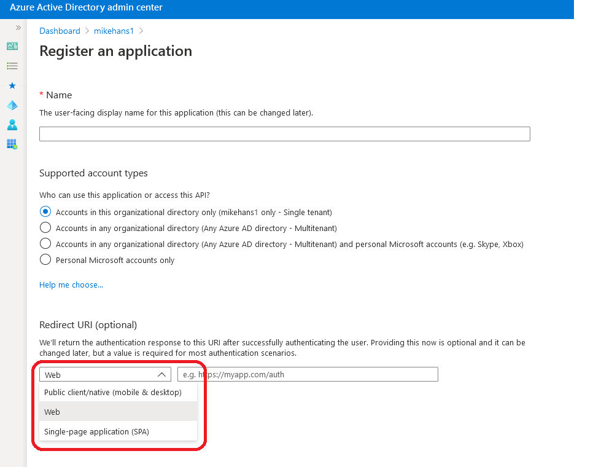

[Return to Table of Contents for the Microsoft Identity (MS-600) posts](microsoft-identity-ms-600)

This is referring to the process of creating the application object in AAD.


### Determine the supported account type
This is talking specifically about the account type for the application object you are creating.


The key here is what do each of the four options under "Supported account types" grant / prohibit. Clicking on the "Help me choose" link is helpful to understanding these.
* Accounts in this organisational directory only (single tenant)
    * an application has something called a home tenant
    * only users in the same home tenant as the application can sign into it (_mikehans1_ in the example)
    * a user must be a _user or guest_ of this tenant
    * this is for use in line of business applications
    * will use SAML tokens for single sign-on (SSO)
* Accounts in any organisational directory (AAD multi-tenant)
    * users in AAD organisations outside of the home tenant can sign into the application
    * useful for ISVs who are sharing (selling!) their application to many clients who use AAD
        * you still have the issue of separating the application's data by tenant - this doesn't magically resolve it
    * in the home tenant, an appliction object will be created as well as a service principal
        * in other tenants, a service principal will be created. This allows administrators of that tenant to assign users and groups to the application
* Accounts in any organisational directory and personal Microsoft accounts
    * this will allow multi-tenancy AAD customers as well as customers using Microsoft accounts
    * will allow for the widest set of Microsoft identites to be used
* Personal Microsoft accounts only
    * intended for consumer-facing scenarios using Microsoft accounts

I've noticed that only Microsoft accounts have been addressed here. How do you allow for people using Google, Twitter or Facebook accounts (et. al)? This will be an area of experimentation. I'm pretty sure I've seen it already though.

#### Resources for this criteria
<a href="https://docs.microsoft.com/en-us/azure/active-directory/develop/quickstart-register-app#register-an-application" target="_blank" rel="noreferrer">Microsoft Documentation for account types</a>

### Select authentication and client credentials for app type and authentication flow
#### App types
OK, so here I'm a little confused. Are "app types" the items that appear in the dropdown list under the Redirect UI


or is it the list of application types listed under the <a href="https://docs.microsoft.com/en-us/azure/active-directory/develop/quickstart-create-new-tenant" target="_blank" rel="noreferrer">Quickstarts</a> section of the MS Doc for Identity, being
* Single Page Apps
* Web apps
* Web APIS
* Mobile and desktop apps
* Daemon apps

or is it the list of <a href="https://docs.microsoft.com/en-us/azure/active-directory/develop/v2-supported-account-types" target="_blank" rel="noreferrer">Application scenarios</a> that appear in the docs, being:
* Single-page apps
* Web app that signs in users
* Web app that calls web APIs
* Protected web API
* Web API that calls web APIs
* Desktop app that calls web APIs
* Daemon app
* Mobile app that calls web APIs

Frankly, these start to sound very similar. The approach I'm taking for now is to understand these in the expectation that the question leads me sufficiently.

What is important is understanding that some apps are public (such as a web app or a UWP app) and some are protected (a daemon or service). Protected apps are called _confidential client applications_. Only confidential client apps can safely use a public key or a secret (a public key is recommended for production). Confidential client applications are sensitive in nature, owing to the kinds of work they do and must be explicitly approved by an admin. For public applications, you want the user to authenticate themselves with user credentials as once the key or secret is out there, a user can do pretty much whatever they want within the scope of the application. I'd be thinking twice about re-using my public / private key pairs... I think that secrets are by definition single use only.

There is also the case where some app types that take the client credential (access token), obtain another token for it and pass it along. I think this is the case of a web app that calls other web APIs. The web app receives the access token, requests a new access token from AAD, then passes along the request to the web API. I'm not sure how much of this I really need to know though. It seems more like something relevant to the security oriented certs. I don't think there's anything of relevance to a developer.

Apps that don't have a user involved, such as daemon apps, do not include user credentials in their flow (obviously). These apps work independently of a user and receive permissions called _application permissions_. This term will most certainly be used in the exam.

#### Resources for this criteria
* <a href="https://docs.microsoft.com/en-us/learn/modules/getting-started-identity/4-different-account-types" target="_blank" rel="noreferrer">MS Learn page</a>

### Define app roles
App roles introduce a separation and interface between the authorisation concerns of the developer and the admin. It allows the developer to specify role permissions within the app and the admin, at app registration time can add users and security groups to these roles. In doing so, the developer won't need to update the code to accommodate administrative changes to groups and users.

It's seems a bit weird that once you create your App Registration, you need to find it in the Enterprise Applications blade and under the Properties section, enable _User assignment required_, in order to enable roles. It would be far more convenient to do this through the App Registration but it is what it is...

Presently, you also need to directly edit the application's manifest (a JSON file) to specify the roles. Helpfully, once you open the Manifest in the App Registration, you get a link to the <a href="https://docs.microsoft.com/en-au/azure/active-directory/develop/reference-app-manifest?WT.mc_id=Portal-Microsoft_AAD_RegisteredApps" target="_blank" rel="noreferrer">documentation for the Manifest file</a>.

#### Notes on the Hands on Lab in MS Learn
The Hands on Lab in MS Learn (<a href="https://docs.microsoft.com/en-us/learn/modules/identity-users-groups-approles/3-exercise-create-web-app" target="_blank" rel="noreferrer">Exercise - Create and secure a web app with Microsoft identity</a>) is out of date. 

When following the lab, I allowed ```Microsoft.Identity.Web``` and ```Microsoft.Identity.Web.UI``` to be at the current versions (both v1.3.0 as at the time of writing) instead of the 0.3.1-preview versions used in the HOL. When you then copy the provided code into the ```ConfigureServices()``` method, VS Code provided me with an error on ```AzureADDefaults.OpenIdScheme```. On inspection of the documentation for the <a href="https://docs.microsoft.com/en-us/dotnet/api/microsoft.aspnetcore.authentication.azuread.ui.azureaddefaults?view=aspnetcore-5.0" target="_blank" rel="noreferrer">AzureADDefaults class</a> there is a warning that this class is obsolete and will be removed and to use Microsoft.Identity.Web instead.

The warning then links to <a href="https://aka.ms/ms-identity-web" target="_blank" rel="noreferrer">https://aka.ms/ms-identity-web</a>. It lists new templates. Looking at this, I should now be using ```dotnet new mvc2``` rather than ```dotnet new mvc``` when commencing a new project.